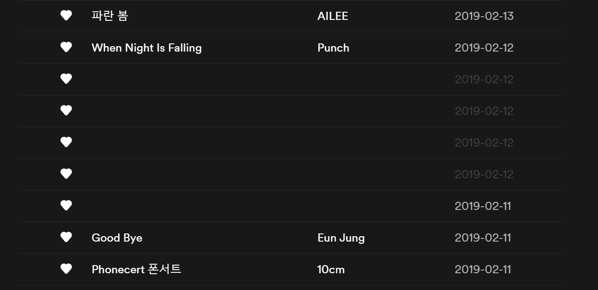
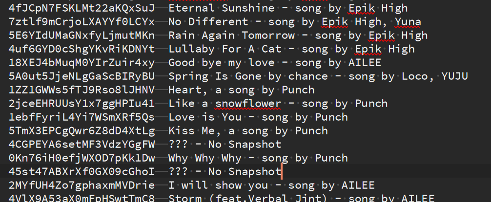

# Spotify Missing Song Recovery

Figure out the songs in your library that Spotify has removed from their system

Missing Songs

Recovered Songs

## Usage

1. Run [Spotify Backup](https://github.com/caseychu/spotify-backup) with the command `python spotify-backup.py playlists.txt --dump=liked,playlists`
2. `python search-missing-songs.py`
3. Check `songs-missing.txt`

Unfortunately, some songs will be missing, since they were not archived in the Wayback Machine. Searching in Google may return some results from their cache.
